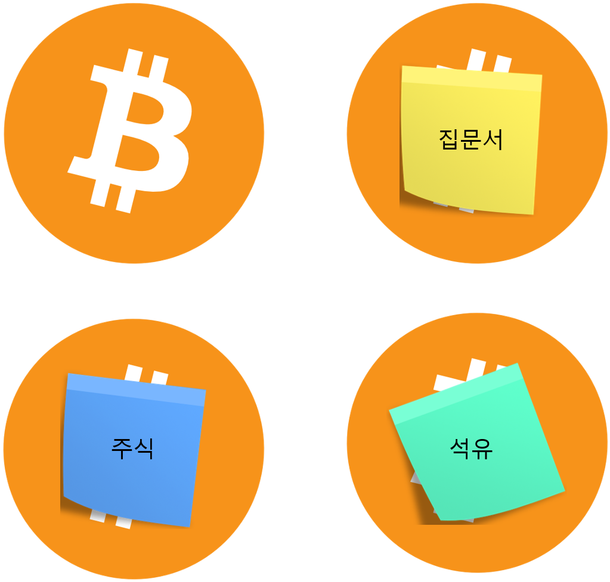
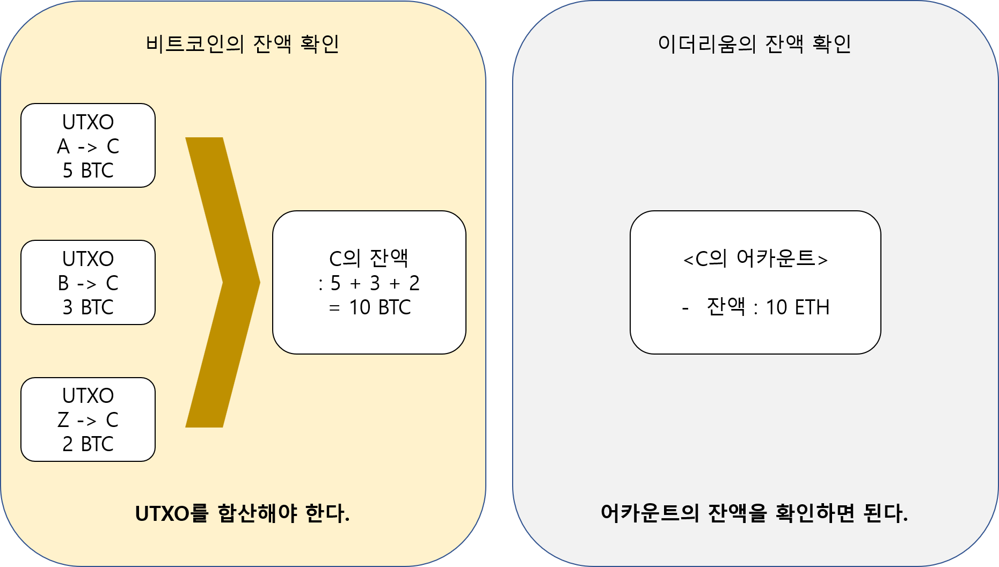
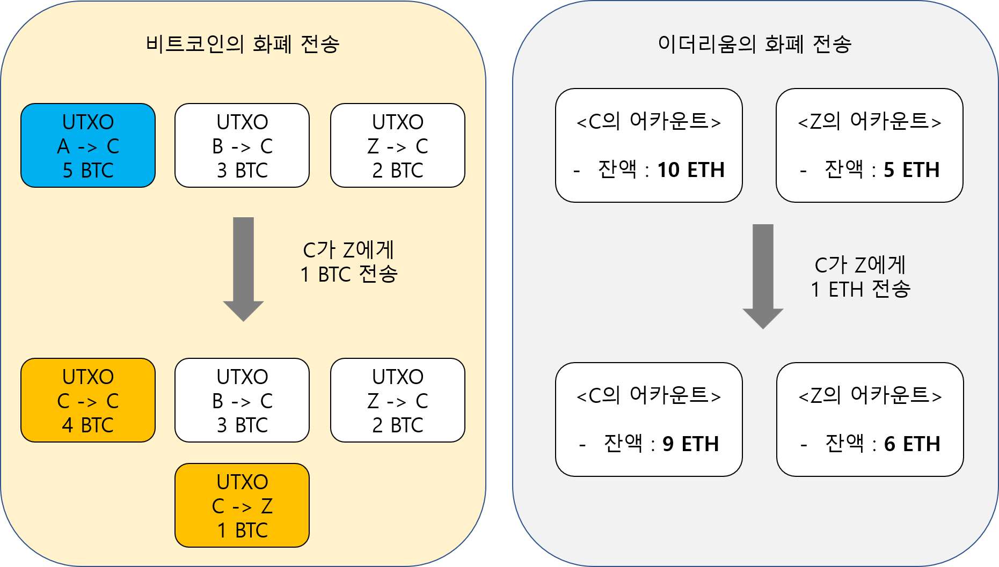
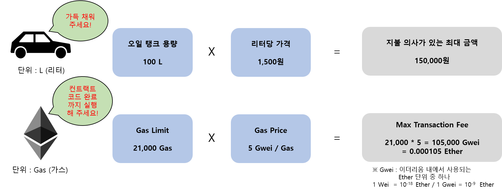
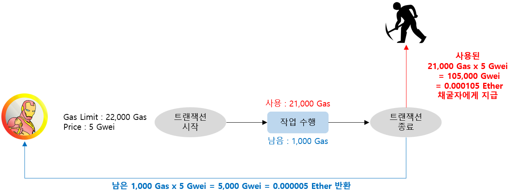
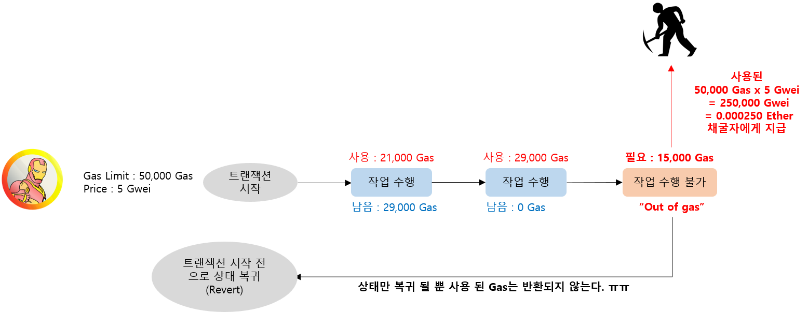

# 이더리움 개념 정리

### 목차
* 이더리움이란?
* 비탈릭 부테린은?
* 이더리움 탄생 배경
* 이더리움의 특징들

### 이더리움이란?
2015년 비탈릭 부테린이 개발한 2세대 블록체인

>Ethereum is a decentralized platform that runs smart contracts: applications that run exactly as programmed without any possibility of downtime, censorship, fraud or third-party interference.

(출처 : http://www.ethereum.org)

**스마트 컨트랙트**(중단, 검열, 사기 또는 제 3자의 방해 가능성이 전혀 없이 **프로그래밍 된 대로 정확히 동작하는 프로그램**)가 동작하는 탈중앙화 된 **플랫폼**.

### 비탈릭 부테린은?


* 1994년 1월 31일 : 만 24살
* 러시아에서 태어나 부모님 취직을 위해서 캐나다로 이민가면서 캐나다에 정착
* 2011년 9월 **[비트코인 매거진](https://bitcoinmagazine.com/authors/vitalik-buterin/)** 창간
* 2013년 이더리움 백서 작성
* 2014년 월드 테크놀로지 어워드 IT 소프트웨어 부문 수상 (페이스북의 마크 저커버그도 함께 후보에 있었음)
* 2015년 7월 30일 이더리움 메인넷 런칭

(출처 : [위키피디아](https://ko.wikipedia.org/wiki/%EB%B9%84%ED%83%88%EB%A6%AD_%EB%B6%80%ED%85%8C%EB%A6%B0), [한국경제 신문](http://news.hankyung.com/article/2014121540821))

### 이더리움 탄생 배경
#### 스마트 컨트랙트 도입
* [마스터 코인에 스마트 컨트랙트 도입 제안](https://vitalik.ca/general/2017/09/14/prehistory.html)
* 거절 당하자 직접 만들어 버림
##### 스마트 컨트랙트란?
* 블록체인 기반으로 금융거래, 부동산 계약, 공증 등 다양한 형태의 계약을 체결하고 이행하는 것을 말한다. 블록체인 2.0이라고도 한다. (출처 : [위키피디아](https://ko.wikipedia.org/wiki/%EC%8A%A4%EB%A7%88%ED%8A%B8_%EA%B3%84%EC%95%BD))
* 기존의 계약

* 스마트 컨트랙트(계약)

(출처 : https://blockchainhub.net/smart-contracts/)
* 예시 - 웹사이트 판매

(출처 : http://etherscripter.com/what_is_ethereum.html)
* 예시 - 가장 기본적인 ICO
    * 1 ETH를 보내면 10 SI를 보내준다.
    * 1SI = 0.1 ETH
    * [이더리움 ICO 코드](https://www.ethereum.org/crowdsale)
#### 비트코인의 문제점 해결
##### 1. 튜링 불완정성 (Lack of Turing-completeness)
비트코인 스크립트로 할 수 있는 작업(서명, 검증 등)이 많긴 하지만 모든 경우의 프로그래밍을 다 지원하지는 않는다. 특히 반복문을 지원하지 않아서 공간 비효율적이다.
* 반복문이란?
    * 프로그래밍 언어에서 동일한 명령을 반복적으로 실행할 수 있게 해주는 명령어
    * for, while 등이 있다.
    * 반복문 사용 전
    ```
    printf("Give me 1 ETH");
    printf("Give me 2 ETH");
    printf("Give me 3 ETH");
    printf("Give me 4 ETH");
    printf("Give me 5 ETH");
    ```
    * 반복문 사용 후
    ```
    for(i=1;i<=5;i++) {
        printf("Give me %d ETH", i);
    }
    ```
* 비트코인이 반복문을 사용하지 않았던 이유
    * 코드 실행 시 무한 루프에 빠지는 것을 방지하기 위해서

=> **튜링 완전한 프로그래밍 언어 지원 & Gas Fee 도입**
 
##### 2. 가치의 불투명성(Value-blindness)
코인의 가치를 외부에서 받아와서(**오라클 문제**) 해당 가치만큼을 분배하려고 할 때, 비트코인의 경우 UTXO에서 일부만 사용이 불가능하다. 일부만 사용하기 위해서는 전체를 input으로 하고 일부를 수신자에게 보내고 나머지를 자신에게 보내는 비효율적인 작업을 해야 한다.
=> **어카운트 개념 도입**

##### 3. 상태의 단순성(Lack of state)
비트코인은 애초에 지불 수단으로 개발되었기 때문에, 비트코인을 주고 받는 용도로 밖에 사용할 수 없다. 다른 데이터를 넣을 수 없다. 그리고 UTXO는 *사용되었다/사용되지 않았다* 라는 두 가지 상태 밖에 표현할 수 없다.
###### 상태를 다양하게 하려던 시도
비트코인의 트랜잭션에 메타 데이터를 넣어서 다른 가치들을 저장하려고 시도
* 컬러드 코인 - [소개영상](https://www.youtube.com/watch?v=fmFjmvwPGKU)
* 네임 코인
* 메타 코인
* 마스터 코인

=> **트랜잭션에 잔액 뿐만 아니라 다른 데이터를 넣을 수 있는 공간을 마련**
##### 4. 블록체인 해석 불가 (Blockchain-blindness)
비트코인의 트랜잭션에서는 블록체인 내에서 랜덤성을 띄고 있는 값들(논스, 이전 블록의 해시, 타임스탬프)을 불러서 사용할 수 없다. 그래서 비트코인은 지급 결제 기능 외의 랜덤성을 요구하는 도박과 같은 어플리케이션을 만드는게 한계가 있다. 비트코인 스크립트의 한계
=> **World States 개념을 도입하고, 블록의 상태를 읽어 올 수 있는 명령어 등을 제공**

### 이더리움의 특징들

#### 어카운트
##### 어카운트란?
=> ~~가치 불투명성의 해결책~~ **UTXO의 비효율성 해결**
* 모든 트랜잭션의 실행 주체이자 기본 단위로서 모든 것은 어카운트에서 시작한다.
* 이더리움 내의 화폐 단위 ETH(이더) 잔액을 가지고 있다.
* 스마트 컨트랙트 코드를 포함하고 있다.
* 어카운트 정보
    * **넌스(nonce)** : 해당 어카운트로부터 보내진 트랜잭션의 수, 0으로 시작한다. 트랜잭션을 오직 한 번만 실행되게 할 때 사용하는 카운터.
    * **잔액(balance)** : 어카운트의 이더 잔고
    * **루트(root)** : 해당 어카운트가 저장 될 머클 패트리시아 트리의 루트 노드
    * **코드해시(codehash)** : 스마트 컨트랙트 바이트 코드의 해시
##### 비트코인과의 비교
* 잔액 확인

* 화폐 전송


##### EOA(Externally Owned Account)
* Etherscan에서 EOA 표시 : https://ropsten.etherscan.io/address/0x00f5b4e383a75dfe334e1af45ce8324b2ac0da8f
* 일반적인 이더리움 사용자 어카운트
* 사람이 직접 개인키(Private Key)를 관리하며, 스마트 컨트랙트 코드를 가지고 있지 않다.
* 개인키로 서명한 트랜잭션을 생성하여 다른 EOA나 CA에게 메세지를 보낼 수 있다.
* 보통 EOA 간의 메세지는 이더를 전송하는 것이고, CA에게 보내는 메세지는 스마트 컨트랙트를 실행하는 것이다.

##### CA (Contract Account)
* Etherscan에서 CA 표시 : https://ropsten.etherscan.io/address/0x3c4096abd295430ac68ab3ab5f03c0c17b777ea9#code
* 일반적으로 부르는 스마트 컨트랙트의 정식 용어가 컨트랙트 어카운트이다.
* EOA나 다른 CA의 메세지를 받은 후 내부의 스마트 컨트랙트 코드를 실행한 후, 새로운 컨트랙트를 생성하거나 다른 메세지를 읽거나 보낸다.
* 필요하면 내부 저장 공간에 **데이터를 저장**할 수도 있다.
* EOA나 다른 CA에 의해서만 작동하고, 직접 새로운 트랜잭션을 실행할 수는 없다.


(출처 : http://best-trading.eu/how-does-ethereum-work/)

#### 메세지와 트랜잭션
##### 트랜잭션
* EOA의 개인키로 서명된 메세지 패키지
* 구성 요소
    * AccountNonce : 발신자가 보낸 트랜잭션의 개수를 의미하며, 0으로 시작한다.
    * **Price** : 수수료로 지급할 Gas 가격 (Wei)
    * **GasLimit** : 최대 Gas 사용 범위
    * Recipient : 수신처의 주소
    * Amount : 전송할 이더의 양 (Wei)
    * **Payload** : 옵션 필드로 스마트 컨트랙트 호출 시 필요한 매개변수를 저장할 수 있다. => **Lack of state 해결**
    * V,R,S : 서명에 필요한 값들
##### 메세지 (or 내부 트랜잭션)
* CA가 다른 CA에서 보내는 트랜잭션
* CA가 보내기 때문에 서명이 되어 있지 않다.

#### 상태 변환 함수
* 상태 변환 시 오류가 없는 지 체크하고 오류가 없을 경우 해당 상태로 변환시킨다.
##### 비트코인의 상태 변환

* UTXO의 생성, 제거로 표현
##### 이더리움 상태 변환

* 어카운트의 상태 변화로 표현

#### 코드 실행
##### 프로그래밍 언어
=> **튜링 불완전성 해결**
* Solidity
* Serpent
* LLL(Low Level OPCODE)
##### EVM(Ethereum Virtual Machine)
* 프로그래밍 언어로 작성 된 코드가 [플랫폼(윈도우, 리눅스, 맥)에 상관없이 작동](https://geth.ethereum.org/downloads/)할 수 있도록 통역해 주는 역할


(출처 : https://opentutorials.org/course/2869/18360)
##### 코드 실행의 물리적 위치
* 블록을 전파받고 검증하는 모든 노드들에서 동일하게 실행되어, 동일한 상태를 유지할 수 있게 한다.

#### 블록체인과 채굴
##### 블록 구조
* 비트코인 블록
   * 구성
      * 이전 블록헤더 해시
      * 타임스탬프
      * 트랜잭션 머클트리 루트
      * 논스
   * 예시
      * https://blockchain.info/en/block-height/519926


(출처 : https://ethereum.stackexchange.com/questions/2286/what-diagrams-exist-to-illustrate-the-ethereum-blockchain-creation-process)

* 이더리움 블록
   * 비트코인과의 차이점
      * 트랜잭션 리스트
      * 가장 최근 상태의 복사본
      * 블록 넘버
      * 난이도 (비트코인에도 bits가 있는데 왜??)
   * 예시
      * https://etherscan.io/block/5509375 (엉클 블록 포함)
      * https://etherscan.io/block/5509378 (엉클 블록 미포함)


(출처 : https://ethereum.stackexchange.com/questions/2286/what-diagrams-exist-to-illustrate-the-ethereum-blockchain-creation-process)
##### 어카운트 상태 저장 - 머클 패트리시아 트리
* 블록에 연결되어 있는 트리 종류
   * 트랜잭션 머클 트리 루트 (불변)
   * 리시트(트랜잭션 수행 결과) 머클 트리 루트 (불변)
   * 상태 머클 패트리시아 트리 루트 (가변)
* 수시로 변경 되는 상태(어카운트 잔액 및 컨트랙트 데이터)를 효율적으로 저장하기 위한 자료구조
* 변경 된 부분만 새로 저장하고 나머지는 그냥 이전 데이터의 주소로 연결한다.


(출처 : https://blog.ethereum.org/2015/11/15/merkling-in-ethereum/)
##### 블록 검증 알고리즘

* 기본적으로 블록 생성 시 수행하는 트랜잭션 자체에 대한 검증 수행
* 트랜잭션을 전체 다 수행 할 때 소모된 총 Gas가 블록의 GasLimit을 초과하지 않는 지 검증
* 이전 블록 마지막 상태에서 시작해서 모든 트랜잭션을 수행 한 후의 상태가 현재 블록에 기록 된 상태와 같은지 검증
##### 채굴
* 합의 알고리즘
   * 작업증명(PoW, Proof of Work)
   * 순차적으로 지분증명(PoS, Proof of Stake)으로 변환할 예정. [Casper](http://eips.ethereum.org/EIPS/eip-1011)
* Etash - Anti-ASIC 작업증명
   * SHA256 해시만 수행하면 됐던 비트코인과 다르게, 범용적인 명령어들을 수행해야 됨
   * CPU 뿐만 아니라 수 GB에 해당하는 메모리를 사용해야 함
   * ASIC(Application Specific Integrated Circuit, 주문형 반도체) 사용이 어렵게 만들었으나, [비트메인에서 출시해서 7월 배송 예정](https://blockinpress.com/archives/4115)

#### 수수료(Gas)
##### 트랜잭션
* Price : Gas 당 트랜잭션 요청자가 지급할 금액
* GasLimit : 트랜잭션 수행에 소비될 총 가스 예상량 (무한 루프 방지)
* 기본 개념

* 트랜잭션 성공 시

https://ropsten.etherscan.io/tx/0x2d1adffaea2fd77d99cbf07880441a3b6caaa3de5420012fd5b0a4a9c914bd84
* 트랜잭션 실패 시

https://ropsten.etherscan.io/tx/0xf188425dd5dee1de1e9a637da2c05a3fa74284e477e8f31b52527abccbc8c99a
* 어떻게 Gas Price, Limit을 결정해야 하는가?
   * https://ethgasstation.info/ 참고해서 결정
   * ICO 같은 경우 권장 사항을 알려줌
##### 블록
* GasLimit : 블록에 담을 수 있는 트랜잭션 GasLimit의 총 합 (2018.4.27 기준 7,996,549 Gas)
* 담을 수 있는 트랜잭션 개수 : 그때 그때 다름 https://etherscan.io/block/5520289
* 어떤 기준으로 트랜잭션을 담는가 : 수수료를 많이 받는 방향으로


# 한 눈에 보는 이더리움 구조


(출처 : https://github.com/4c656554/BlockchainIllustrations/)

#### 참고자료
* 코어 이더리움 프로그래밍 - 박재현,오재훈, 박혜영 지음 : http://www.yes24.com/24/Goods/59621522
* 스팀잇 어미새님 : https://steemit.com/@yahweh87
* 나무 위키 : https://namu.wiki/w/Ethereum
* 한승환님 블로그 : http://www.seunghwanhan.com/2015/06/ethereum-introduction_3.html
* 이더리움 가스 개념 설명 : https://steemit.com/kr/@jinkim/gas-gas-limit-block-gas-limit-gas-price-total-fee
* 이더리움 공식 깃허브 : https://github.com/ethereum/wiki/wiki/Design-Rationale
* 이더리움 공식 블로그 - State Tree Pruning : https://blog.ethereum.org/2015/06/26/state-tree-pruning/
* 이더리움 공식 블로그 - Merkling in Ethereum : https://blog.ethereum.org/2015/11/15/merkling-in-ethereum/
* mark wil cox 블로그 : http://markwilcox.com/articles/01/
* etherchain.org - 블록 Gas Limit : https://www.etherchain.org/charts/blockGasLimit
